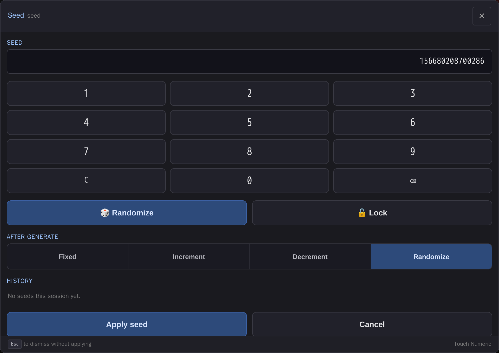

# comfyui-touch-numeric

Touch-friendly keypad, steppers, and slider modal for seed and INT/FLOAT widgets — seed history, lock, and control_after_generate folded in.

> Part of a family of mobile-first ComfyUI usability packs
> ([gallery-loader](https://github.com/laurigates/comfyui-gallery-loader),
> [sampler-info](https://github.com/laurigates/comfyui-sampler-info)):
> touch-friendly HTML modals that replace clunky native LiteGraph controls,
> detected by widget name, additive and non-clobbering.



*The touch keypad modal for `seed` / `noise_seed` widgets: paste or tap an
18-digit value, one-tap Randomize, Lock, `control_after_generate` as a
segmented control, and per-session seed history.*

## Install

```sh
cd <ComfyUI>/custom_nodes
git clone https://github.com/laurigates/comfyui-touch-numeric
```

Restart ComfyUI; hard-refresh the browser tab (Ctrl+Shift+R / Cmd+Shift+R).

## What it does

TODO — describe the widgets it enhances and the modal it opens.

## Compatibility

- ComfyUI: modern Vue frontend (`comfyui-frontend-package >= 1.40`) for the
  `widget.onPointerDown` interception hook.
- Frontend changes (JS/CSS) take effect on browser hard-refresh — no restart.

## License

MIT — see `LICENSE`.
